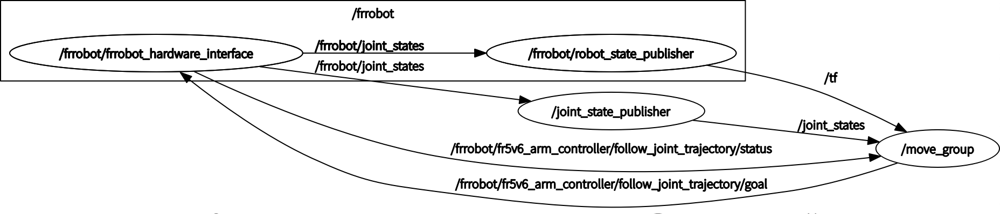
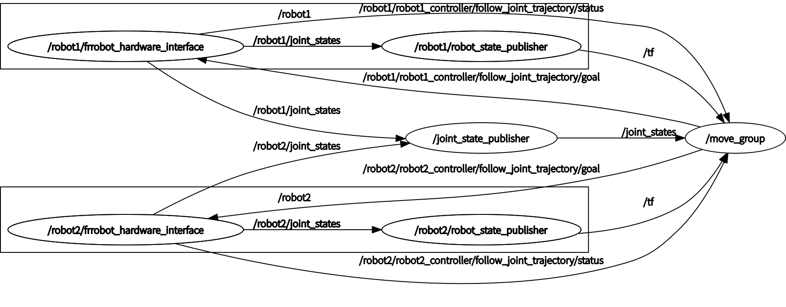

# Dual-robot arm controller

## Description

Robot arm type: FR5

Arm1: Ram&nbsp;&nbsp;&nbsp;&nbsp;&nbsp;&nbsp;ip:192.168.31.202

Arm2: Rem&nbsp;&nbsp;&nbsp;&nbsp;&nbsp;&nbsp;ip:192.168.31.203

Maximum weight of end-effector: 5kg

## Structure

The project is structured as follows:
- **MoveIt!**: Used for motion planning and execution.
  - **fr5v6_dual_moveit_config**: Used for motion planning and configuration of dual robot arms.
  - **fr5v6_single_moveit_config**: Used for motion planning and configuration of a single robot arm.
  - **frcobot_description**:Contains URDF and other description files for the FR5v6 robot arms.
  - **moveit_servo**:Used for real-time servoing of the robot arms. *Note: This feature is not fully implemented.*
- **ROS Controller**: Manages the control loops and interfaces with the hardware.
  - **ros_control_boilerplate**：A ROS controller based on ServoJ commands.

## Installation

To install and set up the project, follow these steps:

1. Clone the repository:
    ```bash
    git clone https://github.com/luojiahao-cn/zlab_robots.git
    cd zlab_robots
    ```

2. Install dependencies:
    In the workspace's `src` directory, run the following command:
    ```bash
    cd catkin_ws/src
    rosdep install --from-paths . --ignore-src -r -y
    sudo apt-get install ros-noetic-moveit
    sudo apt-get install ros-noetic-trac-ik
    sudo apt-get install ros-noetic-ros-controllers
    ```

3. Build the workspace:
    In the workspace's `catkin_ws` directory, run the following command:
    ```bash
    cd ..
    catkin_make
    ```

4. Source the workspace:
    ```bash
    source devel/setup.bash
    ```

## Usage

- To start the single arm controller, use the following command:

    ```bash
    roslaunch frcobot_examples connect_single_arm.launch
    ```
    

- To start the dual-robot arm controller, use the following command:

    ```bash
    roslaunch frcobot_examples connect_dual_arms.launch
    ```
    

- To start the gazebo simulation for a single arm, use the following command:

    ```bash
    roslaunch fr5v6_single_moveit_config demo_gazebo.launch
    ```

- To start the gazebo simulation for dual arms, use the following command:

    ```bash
    roslaunch fr5v6_dual_moveit_config demo_gazebo.launch
    ```


- To add protective boundaries around the robot workspace, use:

    ```bash
    rosrun frcobot_examples environment
    ```
    This will create virtual walls and a table in the planning scene to prevent the robot arm from moving beyond safe boundaries. The environment includes:
    - Three walls (back, left, and right sides)
    - A virtual table in front of the robot
    
    Press Ctrl+C to remove the boundaries when no longer needed.

- To monitor the robot arm's status using the controller feedback protocol, use the following command:

    ```bash
    roslaunch frcobot_status frcobot_status.launch
    ```
    This will launch the status feedback interface, allowing you to view real-time information about the robot arm's state, including joint positions, tool positions, and error codes.


## Common Issues

### Robot Arm Motion Stuttering

If you experience stuttering in the robot arm's motion, follow these steps to diagnose and resolve the issue:

1. Enable Control Loop Monitoring:
   Uncomment the following code in `catkin_ws/src/ros_control_boilerplate/src/generic_hw_control_loop.cpp`:
   ```cpp
   ROS_WARN_STREAM_NAMED(name_, "desired update period of " << desired_update_period_
                               << ", cycle time: " << elapsed_time_
                               << ", exceeded by: " << cycle_time_error
                               << ",> threshold: " << cycle_time_error_threshold_);
   ```

2. Monitor Warning Messages:
   - Watch for cycle time warnings indicating the control loop cannot maintain the desired frequency
   - The warning will show the desired period, actual cycle time, and threshold exceedance

3. Solutions:
   - Reduce the control frequency by modifying the `control_frequency` parameter
   - Improve computer performance by checking CPU usage and closing unnecessary processes
   - Optimize network connection between the robot and controller

### Other Common Issues

#### Connection Problems
If you encounter connection errors, verify:
- Robot IP address is correct
- Network connection is stable
- Firewall settings allow communication on required ports

#### Planning Failures
If motion planning fails, check:
- Target position is within workspace
- No collision present
- Planning parameters are appropriate

#### Error Messages
Common error messages and solutions:
- "Connection lost with robot": Check network connectivity
- "Failed to receive joint states": Verify robot status and connection
- "Control loop cycle time exceeded": Adjust control frequency or system resources

For additional support or specific issues not covered here, please refer to the documentation or contact technical support.